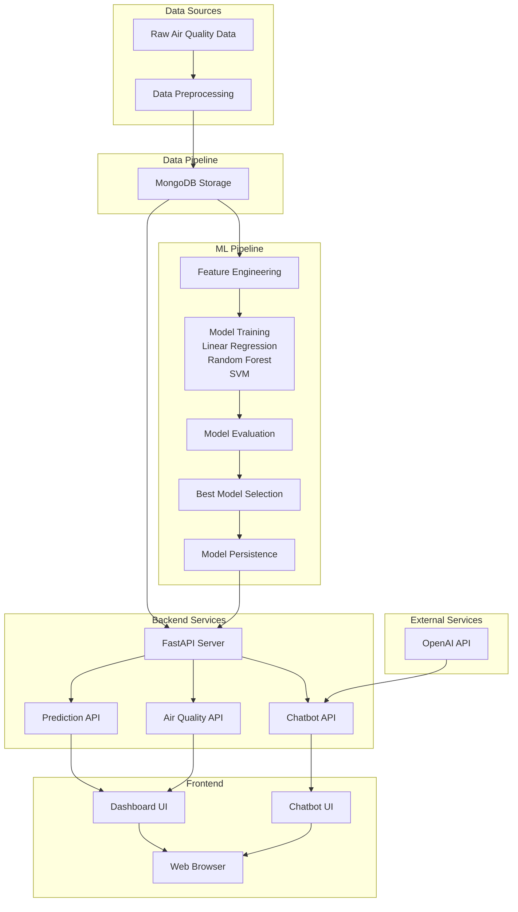

# AirAware Software Architecture

## Overview

AirAware is a comprehensive air quality monitoring and prediction system with the following key components:

1. **Data Pipeline** - Processes raw air quality data
2. **ML Pipeline** - Trains models for air quality prediction
3. **Backend API** - Serves data and predictions
4. **Frontend Dashboard** - Visualizes data and predictions
5. **Chatbot Module** - Provides conversational AI assistance

## Architecture Diagram

## Component Details

### 1. Data Pipeline

**Input**: Raw air quality data in CSV format
**Processing**: 
- Data cleaning and preprocessing (data_preprocessing.ipynb)
- Feature extraction and transformation
- Storage in MongoDB

**Output**: Cleaned data stored in MongoDB collection

### 2. ML Pipeline

**Input**: Cleaned air quality data from MongoDB
**Processing**:
- Feature selection (PM2.5, PM10, CO, NO2, SO2, temperature, humidity)
- Train/test split (80/20)
- Model training with 3 algorithms:
  - Linear Regression
  - Random Forest
  - Support Vector Machine
- Model evaluation using R², MSE, RMSE metrics
- Best model selection and persistence

**Output**: Trained model saved as pickle file

### 3. Prediction API

**Endpoints**:
- `POST /api/v1/predict/pm25` - Predict next PM2.5 value
- `GET /api/v1/predict/latest` - Get latest prediction
- `GET /api/v1/predict/accuracy` - Get model accuracy metrics
- `GET /api/v1/predict/batch` - Get batch predictions
- `GET /api/v1/predict/heatmap` - Get prediction error heatmap

**Flow**:
1. Receive request with air quality data
2. Load trained model
3. Make prediction
4. Return results with metadata

### 4. Dashboard Flow

**Components**:
- Summary Cards - Current air quality metrics
- Recent Data Table - Historical readings
- Prediction Charts - Actual vs Predicted values
- Accuracy Metrics - Model performance indicators
- Error Heatmap - Prediction error visualization
- Chatbot - Conversational AI assistant

**Data Flow**:
1. Dashboard loads
2. Fetches data from backend APIs
3. Renders visualizations
4. Updates in real-time

### 5. Chatbot Module

**Components**:
- Frontend chat interface
- Backend chatbot API
- OpenAI GPT-3.5 integration

**Flow**:
1. User sends message through chat interface
2. Frontend calls chatbot API
3. Backend sends message to OpenAI
4. OpenAI returns response
5. Backend returns response to frontend
6. Frontend displays response in chat bubble